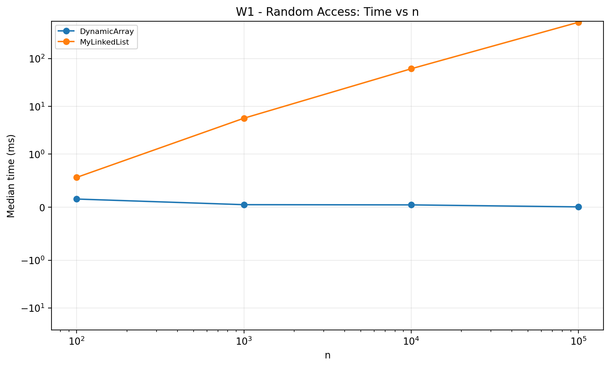
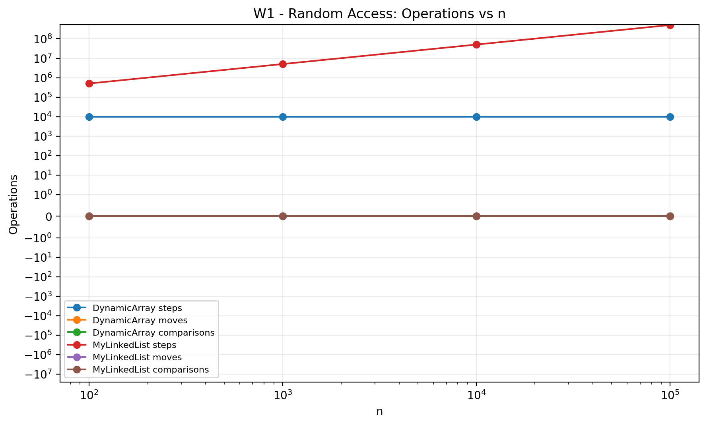
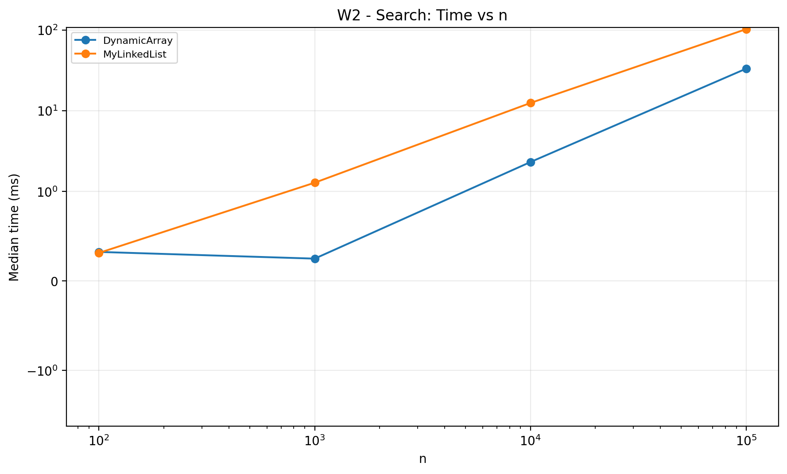
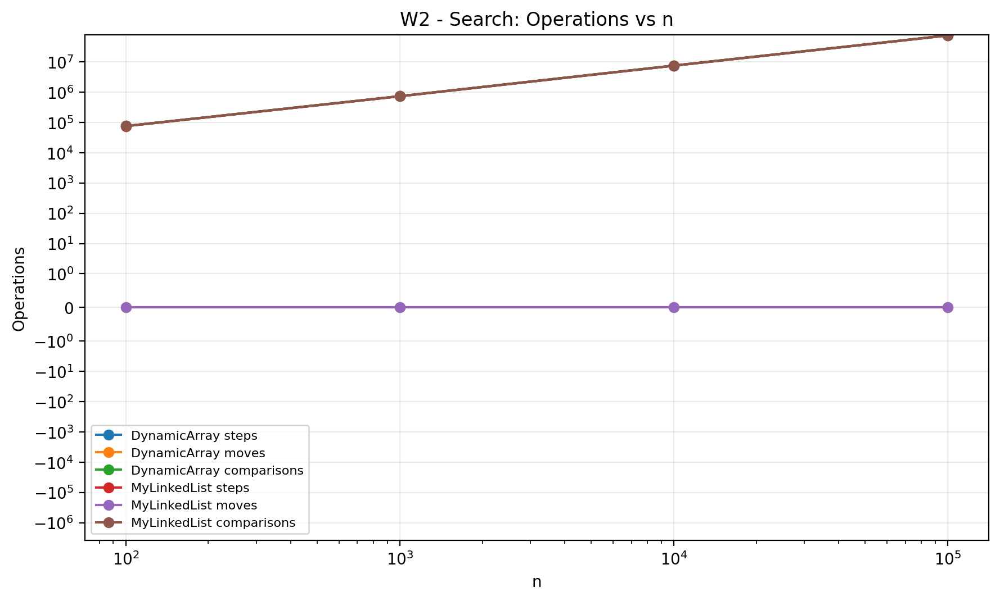
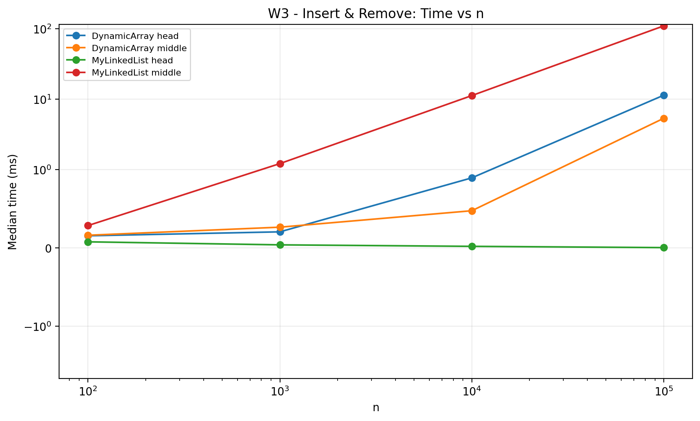
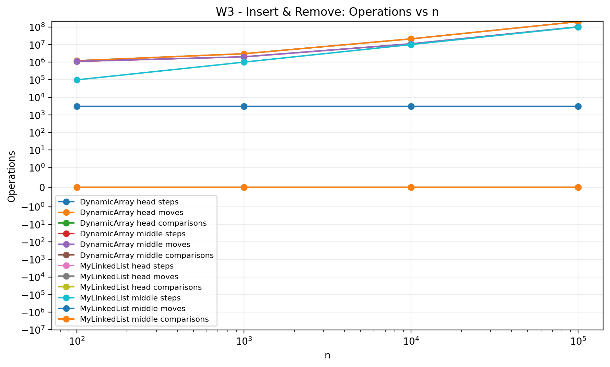
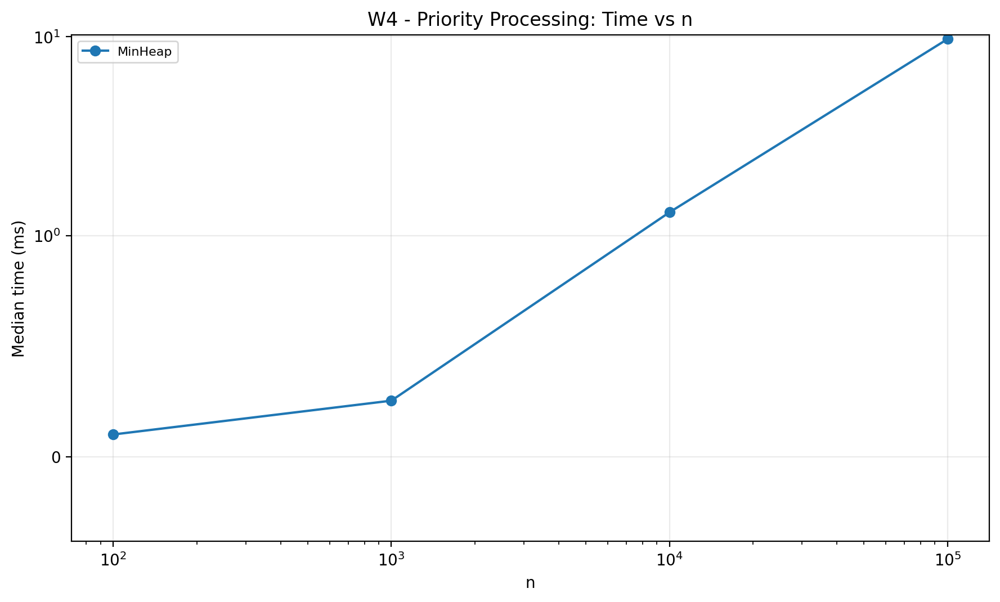
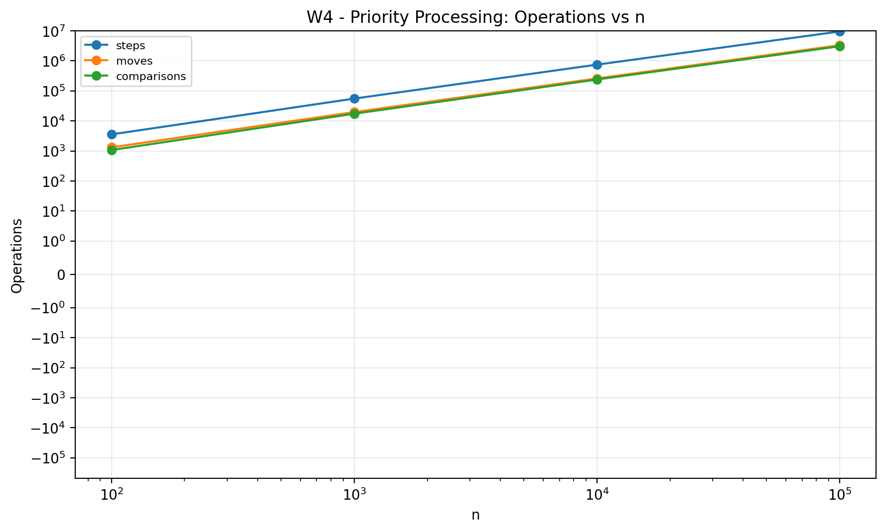

## Loop Invariant 1 — MyLinkedList.contains(x)

### Invariant
Before each iteration of the loop, all nodes before `current`
have already been checked and none of them contains the value `x`.

### Initialization
Before the first iteration, `current` points to the head of the list.
No nodes have been checked yet, so the invariant is true.

### Maintenance
During an iteration, the algorithm checks `current.value`.
If it equals `x`, the method returns `true`.
Otherwise, `current` moves to the next node.
Therefore, all nodes before the new `current` have been checked
and none contains `x`, so the invariant remains true.

### Termination
The loop stops when `current == null` or when the value is found.
If `current == null`, every node has been checked and none contains `x`.

### Conclusion
Therefore, `contains(x)` returns `true` exactly when the value exists
in the linked list, and returns `false` otherwise.

### 2.2 MinHeap.bubbleDown()

#### Invariant
Before each iteration of the loop, the heap property is correct
everywhere except possibly at the current node.

#### Initialization
Before the first iteration, the last element is moved to the root.
The subtrees below the root are still valid heaps.
Only the root may violate the heap property.

#### Maintenance
During each iteration, the algorithm compares the current node
with its left and right children.

If one of the children is smaller, the current node is swapped
with the smallest child.

After the swap, the heap property is restored at the old position.
The only possible violation moves to the new current position.

Therefore, the invariant remains true.

#### Termination
The loop stops when the current node is smaller than or equal to
both children, or when it has no children.

At this moment, the heap property is valid at the current node
and everywhere else in the heap.

#### Conclusion
Therefore, bubbleDown() correctly restores the MinHeap property
after extractMin().

## 1. Complexity Analysis

### 1.1 DynamicArray

| Operation | Best | Average | Worst | Auxiliary Space | Reason |
|---|---|---|---|---|---|
| add(x) | Θ(1) | Θ(1) amortized | Θ(n) | O(n) during resize | Usually adds at the end. When full, the array grows 2x and copies all elements. |
| add(index, x) | Θ(1) | Θ(n) | Θ(n) | O(n) during resize | Elements after the index may need to be shifted. |
| remove(index) | Θ(1) | Θ(n) | Θ(n) | Θ(1) | Removing the last element needs no shifts; other positions may shift elements. |
| get(index) | Θ(1) | Θ(1) | Θ(1) | Θ(1) | An array supports direct access by index. |
| contains(x) | Θ(1) | Θ(n) | Θ(n) | Θ(1) | Linear search stops immediately if the first element matches, otherwise it may scan the array. |

### 1.2 MyLinkedList

| Operation | Best | Average | Worst | Auxiliary Space | Reason |
|---|---|---|---|---|---|
| add(x) | Θ(1) | Θ(1) | Θ(1) | Θ(1) | The list stores a tail pointer, so a new node is added directly at the end. |
| add(index, x) | Θ(1) | Θ(n) | Θ(n) | Θ(1) | Adding at the head is constant time; other positions require traversal. |
| remove(index) | Θ(1) | Θ(n) | Θ(n) | Θ(1) | Removing the head is constant time; other positions require traversal. |
| get(index) | Θ(1) | Θ(n) | Θ(n) | Θ(1) | The list must move from the head to the required node. |
| contains(x) | Θ(1) | Θ(n) | Θ(n) | Θ(1) | The value may be found immediately or after checking all nodes. |

### 1.3 MinHeap

| Operation | Best | Average | Worst | Auxiliary Space | Reason |
|---|---|---|---|---|---|
| insert(x) | Θ(1) | Θ(log n) | Θ(log n) | O(n) during resize | The new element may stay in place or move upward through the heap. |
| peekMin() | Θ(1) | Θ(1) | Θ(1) | Θ(1) | The minimum value is always stored at the root. |
| extractMin() | Θ(1) | Θ(log n) | Θ(log n) | Θ(1) | After removing the root, bubble-down may move through the height of the heap. |

### Space Complexity

DynamicArray uses Θ(n) total storage for its internal array.

MyLinkedList uses Θ(n) total storage because every value is stored inside a separate node.

MinHeap uses Θ(n) total storage because its elements are stored inside an array.

## 3. Benchmark Results and Plots

The benchmark was executed for n = 100, 1,000, 10,000 and 100,000.
Each case used one warm-up run followed by five measured runs.
The median execution time was saved to results.csv.

### 3.1 W1 — Random Access

DynamicArray performs random access in constant time, while
MyLinkedList must traverse nodes from the head to the requested index.

### 3.2 W2 — Search

Both structures use linear search for contains(x), so the number of
comparisons grows with n.

### 3.3 W3 — Insert and Remove

The head variant is very efficient for MyLinkedList because no traversal
is required. DynamicArray must shift elements when inserting or removing
near the beginning.

For the middle variant, both structures perform more work:
DynamicArray shifts elements, while MyLinkedList traverses nodes.

### 3.4 W4 — Priority Processing

MinHeap successfully returned all values in non-decreasing order.
Insert and extractMin use bubble-up and bubble-down, which depend on the
height of the heap.

## 4. Discussion

1. The benchmark results show a clear difference between DynamicArray and MyLinkedList for random access.
2. DynamicArray is much faster for get(index) because it can directly access an array cell in constant time.
3. MyLinkedList must follow node references from the head, so its random access cost grows with the index.
4. DynamicArray also benefits from spatial locality because array elements are stored next to each other in memory.
5. This allows the CPU to load several nearby values into cache lines efficiently.
6. Linked-list nodes may be stored in different memory locations, which causes pointer chasing and more cache misses.
7. In W2, both structures use linear search, but DynamicArray becomes faster for large inputs because of better cache locality.
8. In W3 head operations, MyLinkedList performs very well because insertion and removal at the beginning require only pointer updates.
9. DynamicArray is slower at the head because many elements must be shifted.
10. In the middle variant, MyLinkedList requires many traversal steps, while DynamicArray requires many element moves.
11. MinHeap is a good choice for priority processing because the minimum element is available in constant time and insert/extract operations take logarithmic time.
12. Small timing differences for small n should not be overinterpreted because JVM execution, CPU caching and other runtime effects can influence measurements.